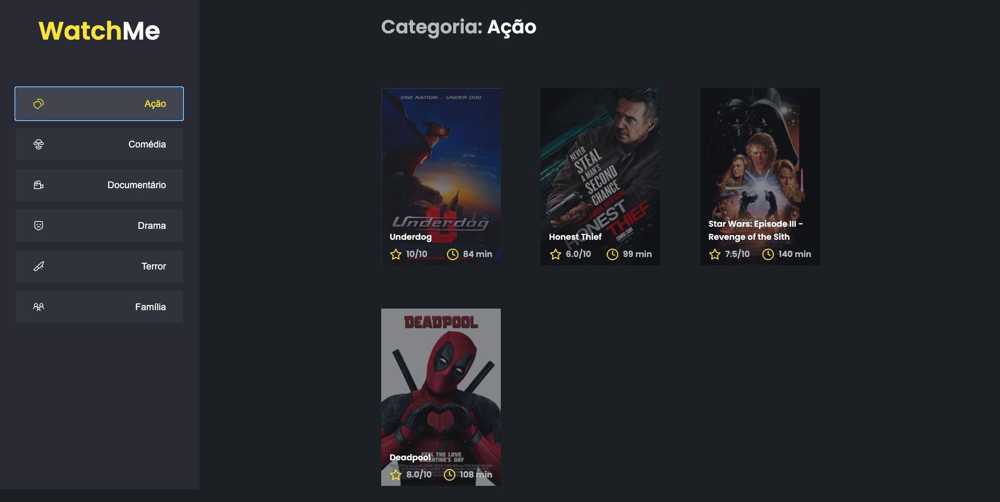

<h1 align="center">
 Desafio 02: Componentização React - WatchMe
</h1>

<p align="center">
  

  <a href="https://www.linkedin.com/in/luanyata/">
    
  </a>

  

  <a href="https://github.com/luanyata/WatchMe/stargazers">
    
  </a>
</p>

## 💻 Sobre o desafio

Nesse desafio, você deverá criar uma aplicação para treinar o que aprendeu até agora no ReactJS

Essa será uma aplicação onde o seu principal objetivo é refatorar uma página para listagem de filmes de acordo com gênero. 

A aplicação já está totalmente funcional mas grande parte do seu código está diretamente no arquivo `App.tsx`. Para resolver isso da melhor forma, é necessário dividir a aplicação em **pelo menos** duas partes principais: sidebar e o conteúdo principal que possui o header e a listagem de filmes.

- A aplicação possui apenas uma funcionalidade principal que é a listagem de filmes;
- Na sidebar é possível selecionar qual categoria de filmes deve ser listada;
- A primeira categoria da lista (que é "Ação") já deve começar como marcada;
- O header da aplicação possui apenas o nome da categoria selecionada que deve mudar dinamicamente.

A seguir veremos com mais detalhes o que e como precisa ser feito 🚀


## Se preparando para o desafio

Para esse desafio, além dos conceitos vistos em aula utilizaremos algumas coisa novas para deixar a nossa aplicação ainda melhor. Por isso, antes de ir diretamente para o código do desafio, explicaremos um pouquinho sobre Fake API com JSON Server.

### Fake API com JSON Server

Assim como utilizamos o MirageJS no módulo 2 para simular uma API com os dados das transações da aplicação dt.money, vamos utilizar o JSON Server para simular uma API que possui as informações de gêneros e filmes. 

Navegue até a pasta criada, abra no Visual Studio Code e execute os seguintes comandos no terminal:

```bash
yarn
yarn server
```

Dessa forma, basta consumir essas rotas da API normalmente com o Axios. Caso queira estudar mais sobre o **JSON Server**, dê uma olhada aqui: [typicode/json-server](https://github.com/typicode/json-server)


## O que devo editar na aplicação?

Os arquivos a serem editados são:

- **src/App.tsx**
Esse componente contém toda a aplicação com exceção do componente `Button` que não precisa ser alterado e `Icon` que também não precisa de alteração.
- **src/components/Content.tsx**
Esse componente, ainda vazio, deve possuir toda a lógica e corpo responsável pelo header e conteúdo da aplicação.
- **src/components/SideBar.tsx**
Esse componente, também vazio, deve possuir toda a lógica e corpo responsável pela seção que contém o título do site e a parte de navegação à esquerda da página :

Se você preferir, pode também componentizar algumas outras partes da aplicação como, por exemplo, o header, mas esse não está como requisito deste desafio 🚀

---
# 📅 Entrega

Esse desafio deve ser entregue a partir da plataforma da Rocketseat. Envie o link do repositório que você fez suas alterações. Após concluir o desafio, além de ter mandado o código para o GitHub, fazer um post no LinkedIn é uma boa forma de demonstrar seus conhecimentos e esforços para evoluir na sua carreira para oportunidades futuras.

Feito com 💜 por Rocketseat 👋 Participe da nossa [comunidade aberta!](https://discord.gg/pUU3CG4Z)
